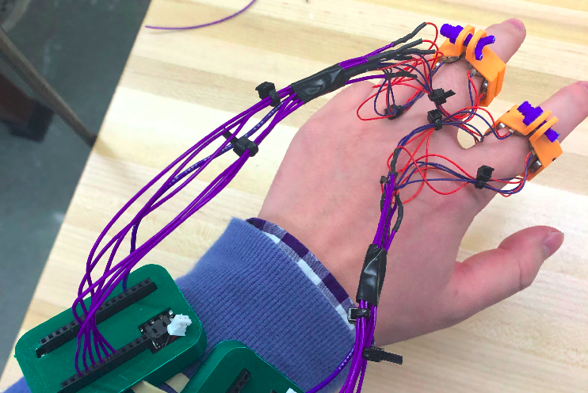
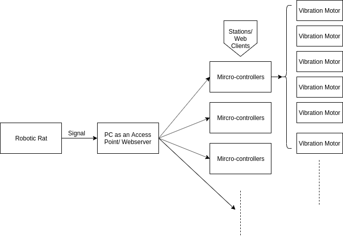

# A Haptic Feedback Device to simulate whisking of A Robotic Rat

#### _Jingyan Ling_
**October ~ December 2019**

The objective of this project is to develop a haptic feedback device to simulate the active whisking of a robotic rat. Previous works have demonstrated that rats can sense the environment from the bending of their whiskers. This project tries to explore this phenomenon by delivering such a sense of bending to humans haptically. The device includes six micro vibration motors in a group to represent the magnitude and direction of a signal. We use the Wi-Fi module of multiple micro-controllers to have a portable and accessible device.

## Method

#### System Pipeline

We use vibration motors to represent signals from the robotic rat. The computer receives the signal through the USB port and serves as an Access Point to broadcast filtered signals. Several micro-controller connect to the AP, serves as stations, and listen to incoming signals. Each micro-controller is assigned to proceed with one whisker data and uses output compare pins to control motors based on the direction and magnitude of such data. The stream of signals from the robotic rat was tested at 200Hz. Each vibration motor updates its frequency at 1Hz.

#### Algorithm & Research Settings

- Direction of the signal
- Magnitude of the signal

## Package Breakdown

## Implementation Instruction

#### Test Environment

- Hardware
- Software
- Package Requirement

