# A Haptic Feedback Device to simulate whisking of A Robotic Rat

#### _Jingyan Ling_
**October ~ December 2019**

The objective of this project is to develop a haptic feedback device to simulate the active whisking of a robotic rat. Previous works have demonstrated that rats can sense the environment from the bending of their whiskers. This project tries to explore this phenomenon by delivering such a sense of bending to humans haptically. The device includes six micro vibration motors in a group to represent the magnitude and direction of a signal. We use the Wi-Fi module of multiple micro-controllers to have a portable and accessible device.

## Method

#### System Pipeline

We use vibration motors to represent signals from the robotic rat. The computer receives the signal through the USB port and serves as an Access Point to broadcast filtered signals. Several micro-controller connect to the AP, serves as stations, and listen to incoming signals. Each micro-controller is assigned to proceed with one whisker data and uses output compare pins to control motors based on the direction and magnitude of such data. The stream of signals from the robotic rat was tested at 200Hz. Each vibration motor updates its frequency at 1Hz.

#### Algorithm & Research Settings

- Direction of the signal
  - 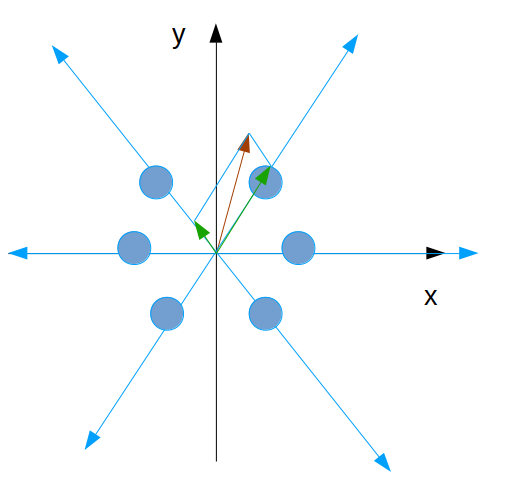
  - Each signal in x-y plane is projected on to 3 axes:
    - Basis 1: (1 , 0)
    - Basis 2: (cos 60, sin 60)
    - Basis 3: (-cos 60, sin 60)
    - 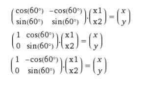
  - Use two motors to provides contrast and enhance the actual feeling from human Magnitude of the signal.
  - 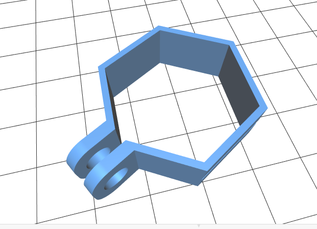

#### Micro-controller
- The micro-controllers serves as web clients that listen to the data streaming at the webserver. 
- The micro-controllers listen to the data at 1Hz and compute duty cycles of PWM on each output compare pin.
- Even each micro-controller listens to data of all whiskers, it only computes and generates PWM waveforms for a specific whisker. 
- Each micro-controller controls one 'ring', which has six vibration motors.

## Result & Implementation Instruction

#### Test Environment

- Hardware:
  - [Adafruit Feather M0 WiFi - ATSAMD21 + ATWINC1500](https://www.adafruit.com/product/3010)
  - [Micro Vibration Motors](https://www.amazon.com/tatoko-Vibration-Button-Type-Vibrating-Appliances/dp/B07L5SY539/ref=asc_df_B07L5SY539/?tag=hyprod-20&linkCode=df0&hvadid=343224601369&hvpos=1o3&hvnetw=g&hvrand=2169028304671473249&hvpone=&hvptwo=&hvqmt=&hvdev=c&hvdvcmdl=&hvlocint=&hvlocphy=1016453&hvtargid=pla-701697446073&psc=1&tag=&ref=&adgrpid=70737352522&hvpone=&hvptwo=&hvadid=343224601369&hvpos=1o3&hvnetw=g&hvrand=2169028304671473249&hvqmt=&hvdev=c&hvdvcmdl=&hvlocint=&hvlocphy=1016453&hvtargid=pla-701697446073)
  - 3D printed Mechanical Designs:
    - [Hex Ring](me_designs/ring-hex-2.stl)
    - [MCU Case Lid](me_designs/haptic_lid.stl)
    - [MCU Case Base](me_designs/haptic_base.stl)
    - [Hex Ring - Screw](me_designs/haptic_screw.stl)
    - [Hex Ring - Nut](me_designs/haptic_nut.stl)
- Software:
  - [Arduino IDE](https://www.arduino.cc/en/main/software)
  - Python 3.7

#### Result & Implementation 

`0. Hardware Connection`

 - Connect micro vibration motors as follows
 - 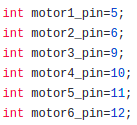
 - See [here](https://learn.adafruit.com/adafruit-feather-m0-wifi-atwinc1500/pinouts) for pin out of the micro-controller,

`1.  AP Connection`

  - Turn on the WiFi HotSpot of the PC by following this [instruction](https://help.ubuntu.com/stable/ubuntu-help/net-wireless-adhoc.html.en) or the documentation of your PC distribution.
  - Type in your username and password in [arduino_secrets.h](w_feather/arduino_code/MCU_as_webclient/arduino_secrets.h).
  - 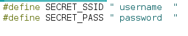
  - Look for the IP address of the AP by command line `ifconfig -a` or the documentation of your PC distribution.
  - 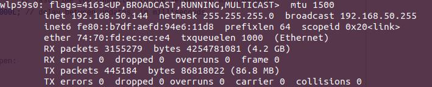
  - Type in the IP address at `line 22` of [MCU_as_webclient.ino](w_feather/arduino_code/MCU_as_webclient/MCU_as_webclient.ino)
  - 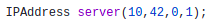

`2. Whisker for each MCU`

- Modify the global variable `WHISKER_INDEX` in [projection.h](w_feather/arduino_code/MCU_as_webclient/projection.h).
- Specify the maximum magnitude of the incoming signals (default: 100.0)
- Specify the lowest effective vibration duty cycle (default: 45)
- 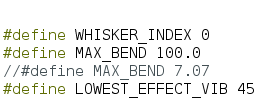
- Load the code to micro-controllers.

`3 Webserver and Data Stream`
- Run [create_webserver.py](w_feather/create_webserver.py) and micro-controllers should connect to the server automatically.
- 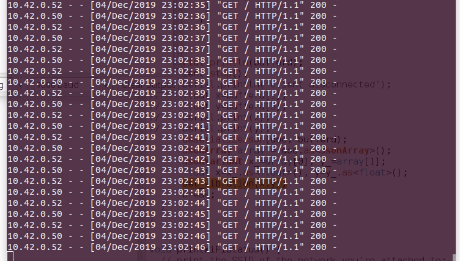
- Stream the data by running [data_stream.py](w_feather/data_stream.py) after specify your data in the file.
- If one of the micro-controller is connected to the PC through a USB port. The following message would show up in Arduino message window.
- 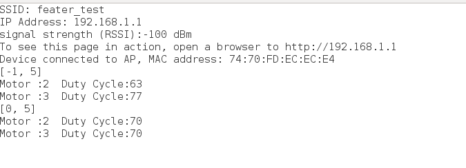

`4. Result`
- You should be able to see the result from windows
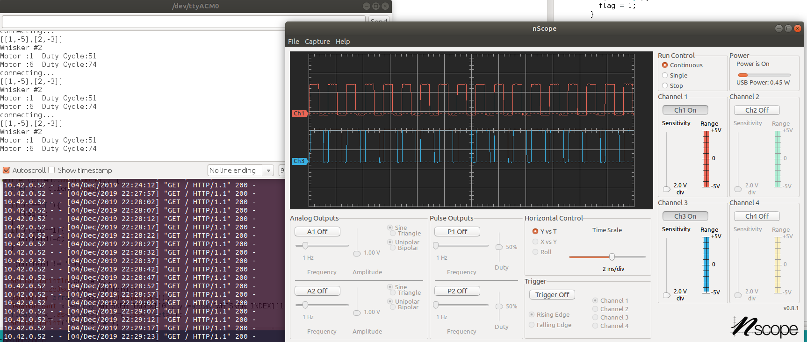

- Feel the message from a rat on your fingers!

